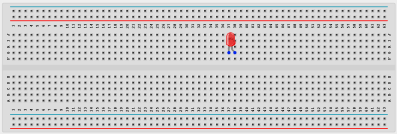
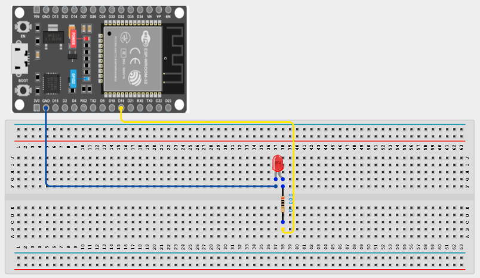

# Project 1.1.1: LED ON

| **Description** |This project shows how to turn on an LED using an ESP32 board. It introduces basic circuit connections and simple ESP32 board programming. |
|------------------|----------------------------------------------------------------|
| **Use case**     | This project finds utility in basic signaling setups. For instance, it could be applied in an easier and basic lighting system, where LEDs turning on together provide ample brightness when someone enters a room. |

## Components (Things You will need)

|  |  |  |  | |
|-------------------------|-------------------------|-------------------------|-------------------------|-------------------------|

## Building the circuit

> **Tip:** Use the [ESP32 Pin Mapping](../../assets/esp32_pin_mapping.png) image to locate the correct GPIO pins on your ESP32 board.


Things Needed:

- ESP32 board = 1

- Micro USB cable = 1

- Red LED = 1

- Jumper wires 

- 220Ω resistor 

## Mounting the component on the breadboard

**Step 1:** Place the LED on the breadboard.

- A standard breadboard has a grid of holes divided into rows (numbered) and columns (lettered). 

- Identify the legs of your LED. The **longer leg** is the positive pin (anode), and the **shorter leg** is the negative pin (cathode).

- Insert the longer positive leg into a specific row (for example, row 10) and the shorter negative leg into a different row (for example, row 11).

Ensure they are not on the same row, otherwise it will create a short circuit.

.

_**NB:** Make sure you identify where the positive pin (+) and the negative pin (-) is connected to on the breadboard. The longer pin of the LED is the positive pin and the shorter one, the negative PIN_.

## WIRING THE CIRCUIT

**Step 2:** Add the resistor and connect to the ESP32.

- Take your **220Ω resistor**.

Insert one end into the same row as the LED's positive leg (row 10).

Insert the other end of the resistor into an empty row nearby.

- Take a **jumper wire** and connect one end to the row where the resistor ends.

Connect the other end of this jumper wire to **GPIO 19** on the ESP32 board.

- Take another **jumper wire** and connect one end to the same row as the LED's negative leg (row 11).

Connect the other end of this wire to any **GND (Ground)** pin on the ESP32 board.




## PROGRAMMING

**Step 1:** Open your Arduino IDE. See how to set up here: [Getting Started](../../Getting Started/Arduino_IDE_Setup.md).

**Step 2:** Configure your pins inside the `void setup()` function.

```cpp
void setup() {
  pinMode(19, OUTPUT);
}
```
*Explanation:* The `void setup()` block runs only once when the ESP32 is powered on or reset. The `pinMode(19, OUTPUT);` command tells the ESP32 that GPIO 19 will be used as an output (to send electricity out to the LED).

**Step 3:** Turn the LED on inside the `void loop()` function.

```cpp
void loop() {
  digitalWrite(19, HIGH);
}
```
*Explanation:* The `void loop()` block runs continuously in a loop. The `digitalWrite(19, HIGH);` command sends a HIGH signal (3.3V) to GPIO 19, which provides power to the LED, turning it ON and keeping it ON.

**Step 4:** Save your code. _See the [Getting Started](../../Getting Started/Arduino_IDE_Setup.md) section_

**Step 5:** Select the ESP32 board and port _See the [Getting Started](../../Getting Started/Arduino_IDE_Setup.md) section:Selecting ESP32 board Type and Uploading your code_.

**Step 6:** Upload your code.

## CONCLUSION
This project helps learners understand how to connect and control an LED using ESP32 board. It is a simple introduction to electronic circuits and programming.


