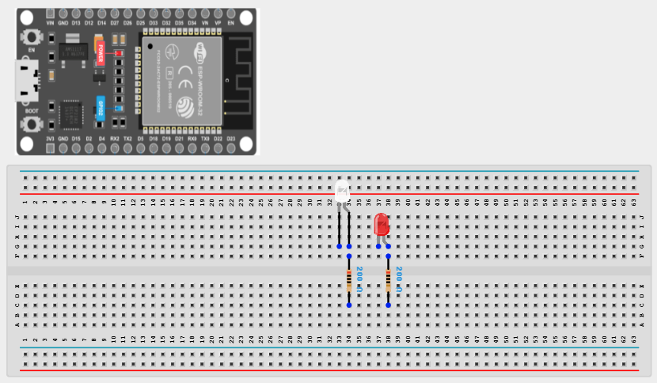
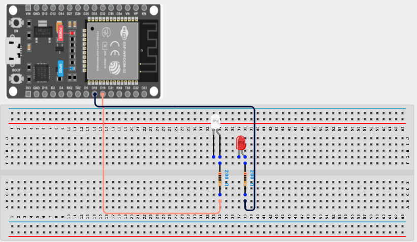
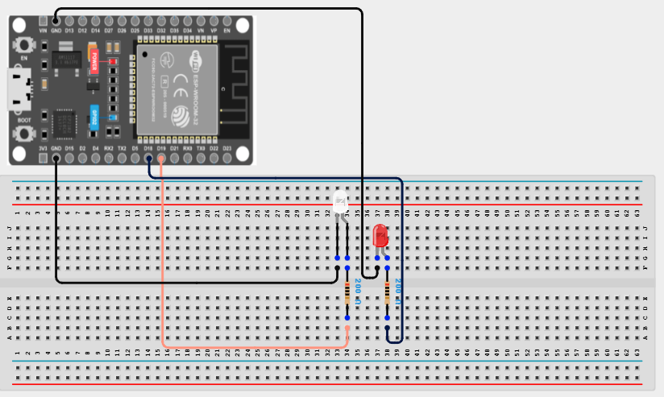

# Project 1.1.3: Double LED ON

| **Description** | Double LED ON is a simple project that guides you in turning on two LEDs at the same time. |
|------------------|----------------------------------------------------------------|
| **Use case**     | This project finds utility in basic signaling setups. For instance, it could be applied in an easier and basic lighting system, where two LEDs turning on together provide ample brightness when someone enters a room. |

## Components (Things You will need)

|  |  |  |  || |
|-------------------------|-------------------------|-------------------------|-------------------------|-------------------------|-------------------------|

## Building the circuit

> **Tip:** Use the [ESP32 Pin Mapping](../../../assets/esp32_pin_mapping.png) image to locate the correct GPIO pins on your ESP32 board.

Things Needed:

- ESP32 board = 1                           

- Micro USB cable = 1

- White LED = 1

- Red LED = 1

- Jumper Wires

- 220Ω Resistor = 2

- Breadboard = 1

---

## Mounting the components on the breadboard

**Step 1:** Mount the ESP32 board and 2 LEDs:

- Align the ESP32 board across the center dividing ridge of the breadboard so that its left pins sit in Column E and its right pins sit in Column F.

- Place the White LED onto the breadboard:
  - Insert the longer positive leg (anode) into **Row 10, Column E**.
  - Insert the shorter negative leg (cathode) into **Row 11, Column E**.

- Place the Red LED onto the breadboard nearby:
  - Insert the longer positive leg (anode) into **Row 13, Column E**.
  - Insert the shorter negative leg (cathode) into **Row 14, Column E**.

- Place a 220Ω resistor bridging from each LED's cathode row to the common ground rail (negative strip).

Connect one resistor from **Row 11, Column D** to the negative rail, and another from **Row 14, Column D** to the negative rail.



---

## Wiring the circuit

Follow these step-by-step connection details using your jumper wires:

**Step 1:** Wire the LEDs to the ESP32

- Connect a jumper wire from **Row 10, Column A** (White LED anode) to **GPIO 19** on the ESP32 board.

- Connect a jumper wire from **Row 13, Column A** (Red LED anode) to **GPIO 18** on the ESP32 board.



**Step 2:** Wire the common Ground

- Connect a jumper wire from a **GND pin** on the ESP32 to the Negative (-) power rail on the breadboard.



*Make sure to connect the Micro USB cable securely to the ESP32 board and your computer.*

---

## PROGRAMMING

**Step 1:** Open your Arduino IDE. See how to set up here: [Getting Started](../../Getting Started/Arduino_IDE_Setup.md).

**Step 2:** Write the code in sections as detailed below.

### 1. Setup Function

```cpp
void setup() {
  pinMode(19, OUTPUT);
  pinMode(18, OUTPUT);
}
```
*Explanation:* The `setup()` function runs once. It configures the two GPIO pins connected to our LEDs (19 and 18) as `OUTPUT`s so they can supply voltage to light up the LEDs.

---

### 2. Loop Function

```cpp
void loop() {
  digitalWrite(19, HIGH);
  digitalWrite(18, HIGH);
}
```
*Explanation:* The `loop()` continuously runs. It uses `digitalWrite()` to send a `HIGH` signal (voltage) to both GPIO 19 and GPIO 18 simultaneously. Since there are no delays or `LOW` commands, both LEDs will turn ON and stay ON indefinitely.

---

## Uploading the code

**Step 3:** Save your code. _See the [Getting Started](../../Getting Started/Arduino_IDE_Setup.md) section_

**Step 4:** Select the ESP32 board and port _See the [Getting Started](../../Getting Started/Arduino_IDE_Setup.md) section:Selecting ESP32 board Type and Uploading your code_.

**Step 5:** Upload your code. _See the [Getting Started](../../Getting Started/Arduino_IDE_Setup.md) section:Selecting ESP32 board Type and Uploading your code_

## CONCLUSION

This project helps learners understand how to control more than one LED with ESP32 board. It is a simple introduction to multiple outputs, circuit connection, and synchronized control.
