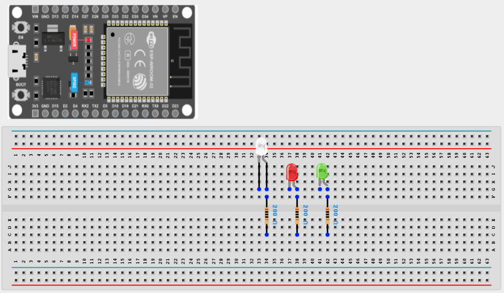
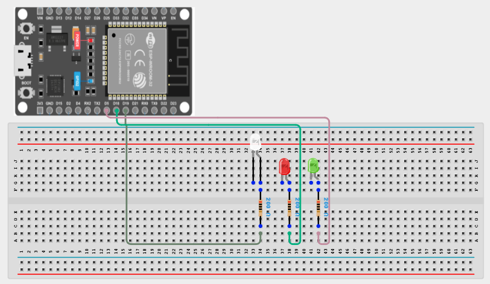
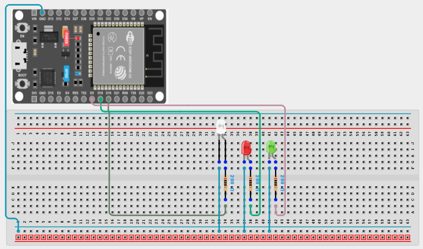

# Project 1.1.5: Triple LEDs

| **Description** | This project shows how to turn on three LEDs at the same time using an ESP32 board. It introduces the control of multiple LEDs using different ESP32 board pins.|
|------------------|----------------------------------------------------------------|
| **Use case**     | This project can represent simple lighting systems, such as streetlights where many lights turn on together. |

## Components (Things You will need)

|  |  |  |  | | |
|-------------------------|-------------------------|-------------------------|-------------------------|-------------------------|-------------------------|

## Building the circuit

> **Tip:** Use the [ESP32 Pin Mapping](../../../assets/esp32_pin_mapping.png) image to locate the correct GPIO pins on your ESP32 board.

Things Needed:

- ESP32 board = 1

- Micro USB cable = 1

- LEDs = 3

- Jumper wires

- 220Ω Resistor = 3

- Breadboard = 1

---

## Mounting the components on the breadboard

**Step 1:** Mount the ESP32 board and 3 LEDs:

- Align the ESP32 board across the center dividing ridge of the breadboard so that its left pins sit in Column E and its right pins sit in Column F.

- Place the 3 LEDs side-by-side along the lower section of the breadboard. For each LED, ensure the longer positive leg (anode) and the shorter negative leg (cathode) are in different rows.
  - **LED 1:** Anode in **Row 20, Column E**, Cathode in **Row 21, Column E**
  - **LED 2:** Anode in **Row 23, Column E**, Cathode in **Row 24, Column E**
  - **LED 3:** Anode in **Row 26, Column E**, Cathode in **Row 27, Column E**

- Place a 220Ω resistor bridging from each LED's cathode row to the common ground rail (negative strip).

Connect one resistor from **Row 21, Column D** to the negative rail, one from **Row 24, Column D** to the negative rail, and one from **Row 27, Column D** to the negative rail.



---

## Wiring the circuit

Follow these step-by-step connection details using your jumper wires:

**Step 1:** Wire the LEDs to the ESP32

- Connect a jumper wire from **Row 20, Column A** (LED 1 Anode) to **GPIO 19** on the ESP32 board.

- Connect a jumper wire from **Row 23, Column A** (LED 2 Anode) to **GPIO 18** on the ESP32 board.

- Connect a jumper wire from **Row 26, Column A** (LED 3 Anode) to **GPIO 5** on the ESP32 board.



**Step 2:** Wire the common Ground

- Connect a jumper wire from a **GND pin** on the ESP32 to the Negative (-) power rail on the breadboard.




*Make sure to connect the Micro USB cable securely to the ESP32 board and your computer.*

---

## PROGRAMMING

**Step 1:** Open your Arduino IDE. See how to set up here: [Getting Started](../../Getting Started/Arduino_IDE_Setup.md).

**Step 2:** Write the code in sections as detailed below.

### 1. Setup Function

```cpp
void setup() {
  pinMode(19, OUTPUT);
  pinMode(18, OUTPUT); 
  pinMode(5, OUTPUT);
}
```
*Explanation:* The `setup()` function runs once. It configures the three GPIO pins connected to our LEDs (19, 18, and 5) as `OUTPUT`s so they can supply voltage to light up the LEDs.

---

### 2. Loop Function

```cpp
void loop() {
  digitalWrite(19, HIGH); 
  digitalWrite(18, HIGH); 
  digitalWrite(5, HIGH);
}
```
*Explanation:* The `loop()` continuously runs. It uses `digitalWrite()` to send a `HIGH` signal to all three GPIO pins (19, 18, and 5) at the same time. Since there are no delays or `LOW` commands, all three LEDs will turn ON and stay ON indefinitely.

---

## Uploading the code

**Step 3:** Save your code. _See the [Getting Started](../../Getting Started/Arduino_IDE_Setup.md) section_

**Step 4:** Select the ESP32 board and port _See the [Getting Started](../../Getting Started/Arduino_IDE_Setup.md) section:Selecting ESP32 board Type and Uploading your code_.

**Step 5:** Upload your code. _See the [Getting Started](../../Getting Started/Arduino_IDE_Setup.md) section:Selecting ESP32 board Type and Uploading your code_

## CONCLUSION

This project helps learners understand how to control three LEDs using ESP32 board. It is a simple introduction to multiple outputs, basic lighting systems, and synchronized LED control.
