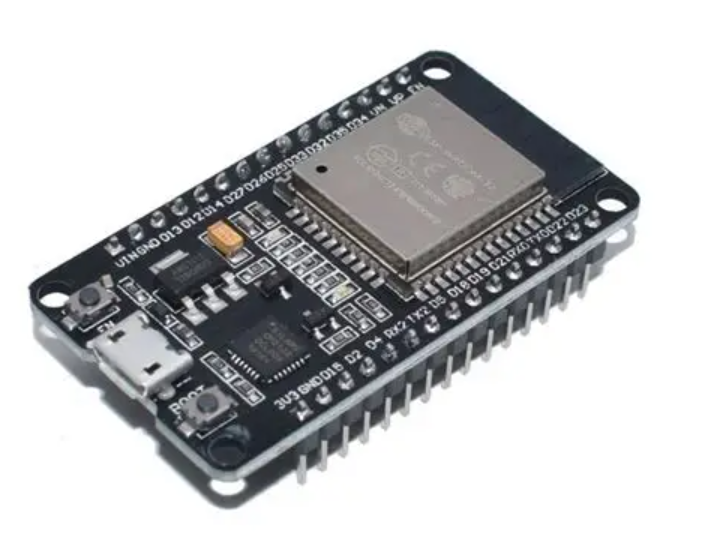

# 4.2.24. IR Remote Servo Turret Positioner

| **Description** In Project 114, learners will construct an expert interactive system titled 'IR Remote Servo Turret Positioner'. This manual details the complete synthesis of IR Remote + Servo Motor SG90 + Active Buzzer + RGB LED Module into an intuitive, high-performance automated control platform.|------------------|----------------------------------------------------------------|
| **Use case**     |This project connects to real-world industrial and IoT applications such as: Project 114 equips students with professional skills in embedded human-machine interface (HMI) design and automated motion control.|

## Components (Things You will need)

|  |  |  |  |  |  |  |  |  |  |  |
| --- | --- | --- | --- | --- | --- | --- | --- | --- | --- | --- |

## Building the circuit

> **Tip:** Use the [ESP32 Pin Mapping](../../assets/esp32_pin_mapping.png) image to locate the correct GPIO pins on your ESP32 board.


Things Needed:

- ESP32 board Core Board

- IR Remote

- Servo Motor SG90

- Active Buzzer

- USB Cable & Jumper Wires

- RGB LED Module

- Bread Board

- Resistor

- IR Receiver


## Mounting the component on the breadboard and wiring the circuit

**Step 1:** Connect the ESP32 board 5V pin to the breadboard's positive (+) power rail and the ESP32 board GND pin to the negative (-) power rail.

**Step 2:** Place the IR Receiver on the breadboard.

  - Connect the VCC pin to the 5V power rail on the breadboard
  - Connect the GND pin to the ground rail on the breadboard
  - Connect the OUT/Signal pin to Digital GPIO 25

**Step 3:** Place the Servo Motor (SG90) on the breadboard.

  - Connect the red wire to the 5V power rail on the breadboard
  - Connect the brown wire to the ground rail on the breadboard
  - Connect the orange/yellow control wire to Digital GPIO 23

**Step 4:** Place the RGB LED Module on the breadboard.

  - Connect the Red, Green, and Blue pins to Digital Pins 5, 6, and 3 respectively through 220Ω resistors
  - Connect the common pin to the ground rail on the breadboard (Common Cathode) or the 5V power rail on the breadboard (Common Anode)

**Step 5:** Place the Active Buzzer on the breadboard.

  - Connect its positive (+) pin to Digital GPIO 22
  - Connect its negative (-) pin to the ground rail on the breadboard

**Step 6:** Ensure all components share a common GND connection, then verify all wiring before connecting the ESP32 board to your computer using the USB cable.


**Step 7:** After confirming that all connections are correct, connect the USB cable to the ESP32 board and the computer to power the circuit.

_Make sure to connect the Micro USB cable to the ESP32 board._

## PROGRAMMING

**Step 1:** Open your Arduino IDE. See how to set up here: [Getting Started](../../Getting Started/Arduino_IDE_Setup.md).

**Step 2:** Write the complete program implementing the system logic with appropriate pin definitions, setup configuration, and the main control loop.

```cpp
#include <ESP32Servo.h>
#include <IRremote.h>

// --- Pin Definitions ---
const int IR_RECV_PIN = 25;  // IR Receiver Signal
const int SERVO_PWM_PIN = 23; // Servo Signal (PWM)
const int BUZZER_PIN = 22;    // Active Buzzer Positive
const int LED_RED = 4;       // RGB Red Pin
const int LED_GREEN = 19;     // RGB Green Pin
const int LED_BLUE = 19;      // RGB Blue Pin

// --- Object Initialization ---
Servo turretServo;
IRrecv irReceiver(IR_RECV_PIN);
decode_results irResults;

void setup() {
  Serial.begin(9600);

  // Start IR Receiver
  irReceiver.enableIRIn();

  // Attach Servo
  turretServo.attach(SERVO_PWM_PIN);
  turretServo.write(90); // Start at center position

  // Configure Output Pins
  pinMode(BUZZER_PIN, OUTPUT);
  pinMode(LED_RED, OUTPUT);
  pinMode(LED_GREEN, OUTPUT);
  pinMode(LED_BLUE, OUTPUT);

  Serial.println("System Ready: Project 114 Online");
}

void loop() {
  // Check if an IR signal is received
  if (irReceiver.decode(&irResults)) {
    long command = irResults.value;
    Serial.print("IR Code Received: ");
    Serial.println(command, HEX);

    // Visual and Audio Feedback
    digitalWrite(BUZZER_PIN, HIGH);
    delay(50);
    digitalWrite(BUZZER_PIN, LOW);

    // Resume receiver for next signal
    irReceiver.resume();
  }
  delay(100); // System stability delay
}
```

**Step 7:** Save your code. _See the [Getting Started](../../Getting Started/Arduino_IDE_Setup.md) section_

**Step 8:** Select the ESP32 board and port _See the [Getting Started](../../Getting Started/Arduino_IDE_Setup.md) section:Selecting ESP32 board Type and Uploading your code_.

**Step 9:** Upload your code. _See the [Getting Started](../../Getting Started/Arduino_IDE_Setup.md) section:Selecting ESP32 board Type and Uploading your code_

## CONCLUSION

Operating physical input devices instantly modifies actuator behavior and updates visual indicators in real time.
